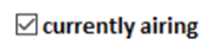
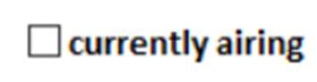
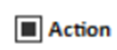
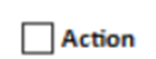
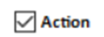
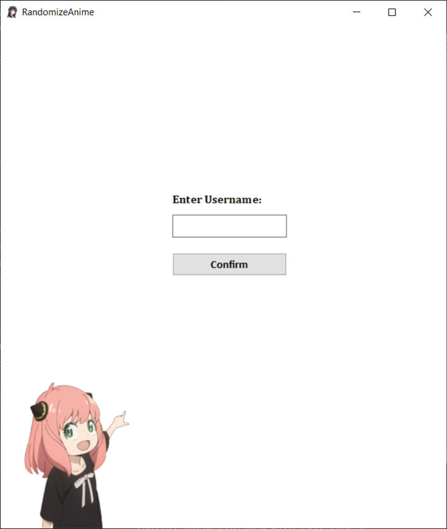
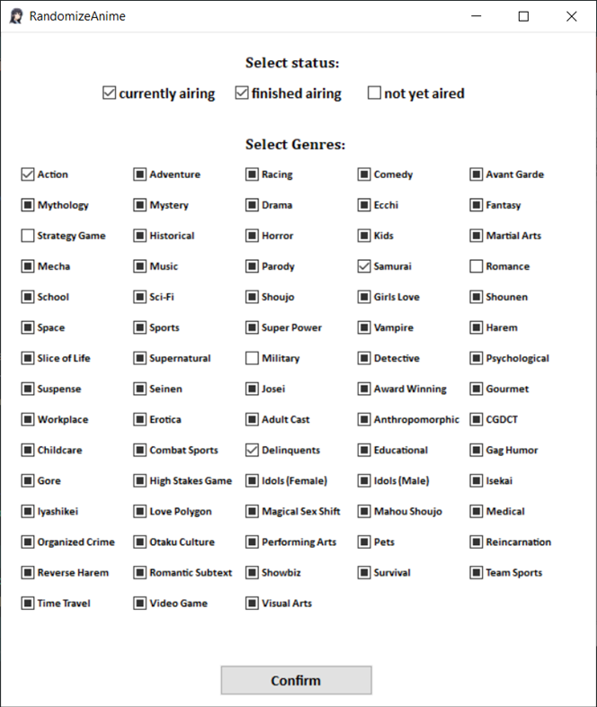
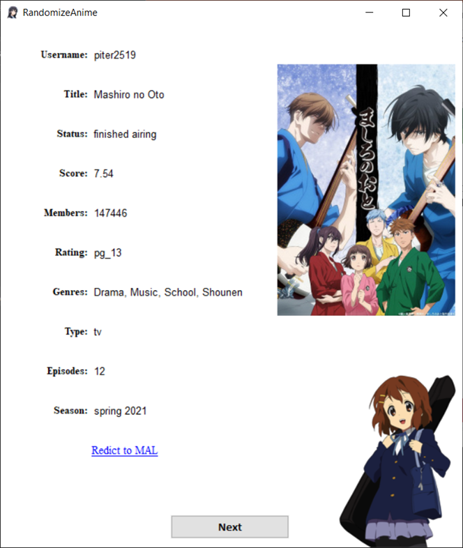

# RandomizeAnime


## Description

RandomizeAnime is an application designed to randomly select an anime title from the user's planned list on MyAnimeList.net based on chosen parameters such as genres. The application displays basic information about the selected anime series.

The application is written using WinApi (windows.h) and CMake for project management. **Internet access is required** for the application to function.

## Installation

1. **Clone the Repository:**
    ```sh
    git clone https://github.com/piter2519/RandomizeAnime.git
    cd RandomizeAnime
    ```

2. **Client ID**
    If you use, you should get and provide your own MyAnimeList API Developer Client ID in "include/client_id.h" path. You can get own client ID by creating account on [MyAnimeList](https://myanimelist.net/) and creating own Client ID on [API site](https://myanimelist.net/apiconfig).

3. **Build the Project:**
    Make sure you have CMake and g++ installed on your computer.
    ```sh
    mkdir build
    cd build
    cmake ..
    make
    ```

4. **Precompiled Version:**
    Alternatively, you can download the precompiled ZIP file from the [releases page](https://github.com/piter2519/RandomizeAnime/releases) and extract it to your desired location.

## Usage
1. **Run RandomizeAnime.exe**

2. **Enter MyAnimeList account username in the box.**

3. **Select specify genres and airing status.** (optional)

How checkboxes working?

for airing status:

 - if checkbox is checked app will include a series with this status (default) \n

 - if checkbox is unchecked app will exclude a series with this status \n

for genres (more complicated): 

 - this means that the genres is neutral and does not influence the randomize process. (default)

 - this means that every series with this genre will be exclude

 - this means that the series MUST have this genre to take part in the randomize process.

4. **Decide if you want download a title's images.** (Optional. May take a while with a lot of Entries!) 

5. **After a first entry show up, you can click "NEXT" Button to show next random entry which meeting your specified genres.**

## Examples

**Entering username menu's and first window of the application**

 

**Selecting genres and status.**



**Example anime series showed in this app.**



## License

This project does not have a specific license. Please note that the usage of the MAL API token might be subject to MyAnimeList's API terms of use.

## Author

Piotr Chajec

